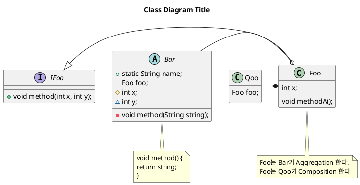

# 클래스 다이어그램(Class Diagram)

- 다이어그램으로 클래스를 표현해서 클래스간의 관계와 내용명세를 묘사한 것

- 시간에 따라 변하지 않는 정적인 시스템 구조를 표현 한다

## 클래스 다이어그램의 목적

- 문제 해결을 위한 도메인 구조를 나타내어 보이지 않는 도메인 안의 개념과 같은 추상적인 개념을을 기술하기 위해서 사용 한다
    - 
- 소프트웨어 설게 혹은 완성된 소프트웨어 구현 설명을 목적으로 사용할 수 있다
    - 오목이라는 게임을 구현하기 위해 인터페이스와 클래스들을 만들고 그 안에 메소드들이 있다면 그 설계를 어떻게 할 것 인지 미리 그려 보고 그 다음에 구현해 보고 다시 설계를 업데이트하는 구현을 진행한다

## Unified Modeling Language(UML)

- 표준화된 모델링 표기 체계

- 클래스를 구현하기 전에 설계하는 단계에서 사용 한다
    - 클래스 이름, 파라미터, 리턴 타입 등을 표현 한다

### UML 작성하기

- @startuml과 @enduml 사이에 다이그램 내용을 입력한다

    ```puml
    @startuml
    @enduml
    ```

    

- 접근제어자는 기호를 활용해 나타낸다

    ```puml
    abstract class Bar{
       + static String name;
       # int x;
       ~ int y;
       - void method(String string);
    }
    ```

    - '+' public
    - '#' protected
    - '~' default
    - '-' private

    

    - 제목은 title 키워드를 활용한다  title +" "

      ```puml
      title Class Diagram Title
      ```

      

    - 메모는 note ~ end note 사이에 적는다

      - 메모의 위치를 지정해주기 위해  note옆에 적어 준다
        - 메모의 위치는 top, bottom, left, right으로 지정해 준다

      ```puml
      note bottom of Bar
       void method() {
       return string;
       }
      end note
      
      note bottom of Foo
      Foo는 Bar가 Aggregation 한다.
      Foo는 Qoo가 Composition 한다
      end note
      ```

      

    #### 클래스간의 관계

    ```puml
    abstract class Bar{
       + static String name;
        Foo foo;
       # int x;
       ~ int y;
       - void method(String string);
    }
    
    class Qoo{
        Foo foo;
    }
    
    class Foo{
        int x;
        void methodA();
    }
    ```

- 클래스들의 관계는 작성한 클래스 아래쪽에  화살표로 표현한다.

  ```puml
  Foo -left|> IFoo
  Bar -o Foo
  Qoo -right* Foo
  ```

  - "-|>" 상속관계 // Foo -|> IFoo // foo가 Ifoo 상속한다
  - "-o" 어그리게이션
  - " -* " 컴포지션 

- Bar -o Foo (어그리게이션 관계)

  - Aggregation : sub클래스가 독립적으로 존재할 수 있다.
    - ex) School - Student, Team - Player, Creep - Tortoise

- Qoo -* Foo 

  - Composition(포함관계) : sub클래스가 독립적으로 존재할 수 없음, Owner 클래스가 없으면 의미없음
    - ex) Human - Leg,Arm and Hearts , Car - Parts..., Zoo - Loby, Bathroom


- 클래스 위치를 설정할 수 있다 

- 위에 관계를 표시해주는 화살표에 left,right등을 써넣어 클래스 위치를 설정할 수 있다


​    

#### 전체 코드 및 결과




#### Aggregation vs Composition

- Aggregation과 Composition의 공통점은, 둘 모두 멤버 변수로 클래스 객체를 사용한다는 점이고. 다른점은, Aggregation의 경우 외부에서 객체가 생성된 후에 참조를 전달받고, Composition의 경우 내부에서 객체가 생성된다는 점이다

- A가 B를 Composition하는 관계가 성립하려면, A 객체 내부에서 B 객체가 생성(new 키워드 사용)되고, A 객체가 사라질 때 B 객체도 같이 사라져야 한다. 

- 에제

  ```java
  /**
   * Aggregation과 Composition의 비교
   *
   * Aggregation과 Composition 모두 'HAS-A' 관계이지만,
   * Aggregation은 두 클래스의 생명주기가 무관하고
   * Composition은 두 클래스의 생명 주기가 같은 것을 의미합니다.
   *
   * 말로 설명하면 복잡하지만, 코드로 보면 간단하니 아래 코드를 확인해 주세요!
   */class Foo {
      int x = 10;
  }class Bar {
      Foo foo = new Foo(); // 이것은 Composition 관계입니다.
  }class Qoo {
      Foo foo;    public Qoo(Foo foo) { // 이것은 Aggregation 관계입니다.
          this.foo = foo;
      }
  }
  public class AggCompCompare {
      public static void main(String[] args) {
          Bar bar = new Bar();
          System.out.println(bar.foo.x); // Foo 객체가 Bar 객체와 함께 생성됩니다. Bar 객체가 사라질 때 Foo 객체도 함께 사라집니다.        Foo foo = new Foo();
          Qoo qoo = new Qoo(foo);
          System.out.println(qoo.foo.x);  // Qoo 객체와 Foo 객체가 별도로 생성됩니다. Qoo 객체가 사라져도 Foo 객체는 사라지지 않습니다.
      }
  }
  ```
  
  

## IDEA 에서 UML 자동 생성

- 패키지나 클래스를 우클릭하면 Diagram 클릭하면 자동으로 UML 생성할 수 있다
  
    - 함정은 IntelliJ ultimate 에서만 사용가능
    
      
    
      
    
