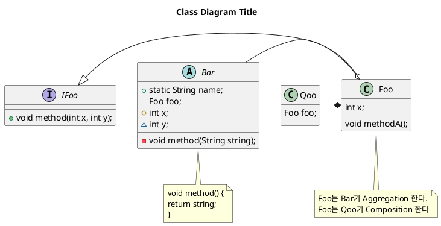

# 클래스 다이어그램

- 다이어그램으로 클래스를 표현해서 클래스간의 관계와 내용명세를 묘사한 것

- 시간에 따라변하지 않는 정적인 시스템 구조를 표현 한다
    - 동적인 시스템에 대한 표현은 우리는 배우지 않는다

## 클래스 다이어그램의 목적

- 문제 해결을 위한 도메인 구조를 표현하기 위함
    - 오목이라는 게임을 구현하기 위해 인터페이스와 클래스들을 만들고 그 안에 메소드들이 있다면
	- 그 설계를 어떻게 할 것 인지 미리 그려 보고 그 다음에 구현해 보고 다시 설계를 업데이트하는 구현을 진행한다

## Unified Modeling Language(UML)

- 표준화된 모델링 표기 체계

- 클래스를 구현하기 전에 설계하는 단계에서 사용 한다
    - 클래스 이름, 파라미터, 리턴 타입 등을 표현 한다

### UML 작성하기

- 문법은 우리가 쓰는 것과 비슷하다

- 접근제어자
    - '+' 퍼블릭
    - '#' 프로텍티드
    - '~' default
    - '-' private
    
- 위에 클래스들 써넣고 아래에 관계를 표현함
    - "-|>" 상속관계 // Foo -|> IFoo // foo가 Ifoo 상속한다
    - "-o" 어그리게이션(포함관계) // 
   

- Bar -o Foo (어그리게이션 관계)
    - Aggregation : sub클래스가 독립적으로 존재할 수 있음, 
        - ex) School - Student, Team - Player, Creep - Tortoise

- Qoo -* Foo ( 포함관계?? 이부분 이해안됫음)
    - Composition(포함관계) : sub클래스가 독립적으로 존재할 수 없음, Owner 클래스가 없으면 의미없음
        - ex) Human - Leg,Arm and Hearts , Car - Parts..., Zoo - Loby, Bathroom
    

- 제목 title"쓰고싶은제목" ex) title Class Diagram Title

- 메모 시작 note+위치 // 끝 end note
    - note left of Foo
    - "하고 싶은 말"
    - end note
    - 위치에는 top bottom left right 들어갈수 있음

- 클래스 위치를 설정할 수 있음 // Qoo -right* Foo >  Qoo가 Foo의 왼쪽에 있다가 오른쪽으로 이동함
 
-  실무에서는 설계자가 설계한데로 구현 하면됨. 그 분은 전문적으로하는사람이라 따라가면됨

## IDEA 에서 UML 자동 생성

- 패키지나 클래스를 우클릭하면 Diagram 클릭하면 자동으로 UML 생성해 줌
    - 함정은 IntelliJ ultimate 에서만 사용가능
